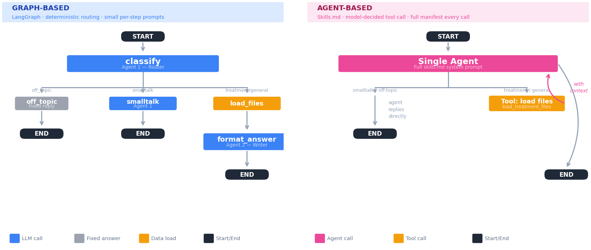
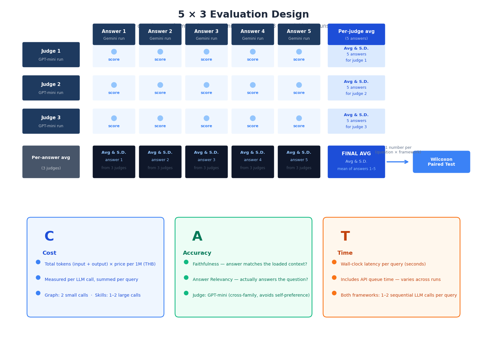

# Graph vs. Skills.md: A Controlled Framework Comparison

A mechanism-level experiment: does the *orchestration framework* — a
`graph-based` state machine with small, per-step system prompts, vs. a single
tool-calling agent driven by one large `skills.md` manifest — change `cost,
running time, or accuracy`, when everything else is held fixed?



Throughout this README:
- **Graph-based framework** = `frameworks/langgraph_impl` (a `LangGraph` state
  machine).
- **Skills-prompt-based framework** = `frameworks/skillsmd_impl` (a single
  tool-calling agent driven by a `skills.md` manifest).

---

## Topic 1. Hypothesis

**H0 (null):** `Cost, running time, and accuracy are statistically
indistinguishable` between the graph-based framework and the
skills-prompt-based framework, once the model, prompts, workflow, and
documents are held constant.

**H1 (alternative):** They are `not the same on at least one axis`, because
the two frameworks *deliver identical instruction text differently*:

- The graph-based framework splits instructions into small, per-step system
  prompts — the router call only sees routing rules, the answer call only
  sees answering rules.
- The skills-prompt-based framework sends the **entire** manifest (routing
  rules + answering rules + every other skill) as the system prompt on
  **every** call, whether or not that step needs it.

The prediction, going in: the skills-prompt-based framework should cost more
and run a little slower per call because of the constant instruction
overhead, and the two should be close to tied on accuracy because the
*content* of the instructions is identical — any accuracy difference would
be evidence that *how* instructions are packaged (not what they say) affects
how well the model follows them.

### Why a paired test over 100 questions

Both frameworks answer the exact same 100-question test set
(`tests/hospital_chatbot_test_questions.xlsx`). Every question produces a
`matched pair` of results — one number from the graph-based framework, one
from the skills-prompt-based framework, for that same question. That is
paired data, not two independent samples of 100, so the comparison uses a
**Wilcoxon signed-rank test on the 100 paired differences** (skills-prompt
score minus graph score, per question), instead of an unpaired t-test on two
unrelated groups.

Pairing matters here because questions vary a lot in
difficulty (a one-line greeting vs. a multi-file price comparison); pairing
cancels that question-to-question variation out, so what's left is the
effect of the framework, not the effect of which questions happened to be
hard.

### Test set composition

The 100 questions cover every case the workflow can branch on — small talk
and off-topic (no document ever touched), general multi-document questions,
and treatment questions spanning 11 distinct treatment categories:

| Category | Count |
|---|---|
| Smalltalk | 10 |
| Off-topic | 10 |
| General info — spans multiple documents (`ข้อมูลทั่วไป/หลายเอกสาร`) | 8 |
| General info — dentist directory (`ข้อมูล - รายชื่อทันตแพทย์`) | 6 |
| Treatment — Scaling & root planing (`ขูดหินปูนและเกลารากฟัน`) | 6 |
| Treatment — Fillings (`อุดฟัน`) | 6 |
| Treatment — Root canal (`คลองรากฟัน`) | 6 |
| Treatment — Crowns & bridges (`ครอบฟันและสะพานฟัน`) | 6 |
| Treatment — Removable dentures (`ฟันปลอมถอดได้`) | 6 |
| Treatment — Veneers (`วีเนียร์`) | 6 |
| Treatment — Orthodontics (`จัดฟัน`) | 6 |
| Treatment — Extraction & wisdom tooth surgery (`ถอนฟันและผ่าฟันคุด`) | 6 |
| Treatment — Bone/soft-tissue reconstructive surgery (`ผ่าตัดตกแต่งกระดูกหรือเนื้อเยื่ออ่อน`) | 6 |
| Treatment — Dental implants (`รากฟันเทียม`) | 6 |
| Treatment — Pediatric dentistry (`ทันตกรรมเด็ก`) | 6 |
| **Total** | **100** |

---

## Topic 2. What is actually being tested (read this before you trust the result)

### Same — held constant on purpose

| # | What's the same | Where it lives | How it's enforced |
|---|---|---|---|
| 1 | Prompt text — both frameworks use the identical Agent A (router/classifier) and Agent B (answer formatter, Thai/English) instructions | `shared/prompts.py` | `python -m scripts.verify_prompt_sync` asserts every prompt constant appears byte-for-byte inside the skills-prompt-based framework's generated manifest |
| 2 | Config — model, temperature, pricing | `shared/config.py` | Same model for both roles, both frameworks; `temperature = 0` for every call; same price table used to estimate cost |
| 3 | LLM call plumbing | `shared/llm_client.py` (`call_llm()`) | The only function either framework uses to hit the API — no framework-specific HTTP, retry, or token-counting code |
| 4 | File loader | `shared/file_loader.py` (`load_files()` / `build_context_text()`) | The only code path either framework uses to read the 13 source DOCX files and build the `CONTEXT` string an answer is grounded in |

Agent A decides the `route` (off_topic / smalltalk / treatment / general)
and, for treatment questions, which file numbers to load. Agent B then
writes the final reply from the loaded `CONTEXT`, in Thai or English
depending on the question.

### Different — this is the thing being measured

The two frameworks deliver the *identical* instruction text above through
structurally different call patterns:

| | Graph-based framework | Skills-prompt-based framework |
|---|---|---|
| Structure | 3 nodes: `classify` → (`off_topic` \| `smalltalk` \| `load_files` → `format_answer`) | 1 agent, up to 2 sequential tool-calling turns |
| System prompt per call | Small, per-step — the router call sees only the routing rules; the answer call sees only the answering rules + context | One large system prompt (the full generated `skills.md`) — routing rules + answering rules + every other skill — sent on **every** call, whether or not that step needs it |
| Routing mechanism | Deterministic, code-routed graph edges | Model-decided tool call inside one agent loop |

Same instruction *content*, delivered as many small targeted prompts (graph)
vs. one always-on manifest (skills.md) — see the diagram at the top of this
README. This packaging difference is the mechanism under test.

---

## Topic 3. Why 5 answer repeats x 3 judge repeats



*The diagram above shows the repeat design for `one question, one
framework`. 

Every question in the 100-question test set is run through
**both frameworks**, each averaged the same way, and the two per-question
averages are then compared as a matched pair (Topic 1) — that's the paired
test across all 100 questions. This run used **5 answer repeats × 3 judge
repeats** ("5x3") to keep judge cost down while still measuring judge noise
directly; see Topic 8 for running the full N=5 design.*

`temperature=0` does not guarantee an identical output on every call to a
hosted LLM API — batching, routing, and infra noise can still change the
result. Rather than assume determinism, the harness measures it directly:

| Step | Repeated | Why |
|---|---|---|
| Answer generation | **5x** per question, per framework | Shows whether a framework's cost, latency, and answer are actually stable, instead of trusting a single call |
| RAGAS judging | **3x** per answer | The judge (gpt-5-mini) is itself an LLM call with its own run-to-run noise, separate from any noise in the answer it's judging |

Each answer repeat is scored by 3 judge calls and averaged first — so the
final per-question, per-framework number is a mean of 5 answer-generation
repeats, each already a mean of 3 judge repeats. Every table also reports SD
and CV%.

### What each output CSV looks like

1. **`raw_runs.csv`** — 200 rows (100 questions × 2 frameworks), 5 repeat
   columns per raw metric (`cost_thb_1..5`, `latency_s_1..5`, etc.) plus an
   `_avg`/`_sd` per metric. Preview:

   | question_id | framework | route | cost_thb_avg | cost_thb_sd | latency_s_avg | latency_s_sd |
   |---|---|---|---|---|---|---|
   | 45 | langgraph | treatment | 0.0172 | 0.0000 | 2.181 | 0.105 |
   | 45 | skillsmd | treatment | 0.0334 | 0.0000 | 2.154 | 0.210 |

   (`cost_thb_sd` is 0 for question 45 because Gemini token counts — and
   therefore cost — happened to be identical across all 5 repeats for that
   question; latency still varies repeat-to-repeat because it's wall-clock
   time, not token count.)

2. **`scored_runs.csv`** — same 200 rows, with RAGAS metrics added
   (`faithfulness`, `answer_relevancy`, `ragas_average`), each with an
   `_avg`/`_sd` across the 5 answer repeats and a `_judge_sd` across the 3
   judge calls per repeat. Preview:

   | question_id | framework | faithfulness_avg | answer_relevancy_avg | ragas_average_avg | ragas_average_sd |
   |---|---|---|---|---|---|
   | 45 | langgraph | 0.940 | 0.409 | 0.674 | 0.038 |
   | 45 | skillsmd | 0.961 | 0.366 | 0.664 | 0.036 |

3. **`paired_stats_summary.csv`** — 3 rows, one per axis (cost, running
   time, RAGAS average), pivoting the `_avg` columns above into
   graph vs. skills-prompt pairs and running the Wilcoxon test across all
   100 questions. This is the table in Topic 4.

### Same question, both frameworks, different metrics

Question 45 (`ฟันปลอมถอดได้ราคาเท่าไหร่` / "How much does a removable
denture cost?"), compared across frameworks:

| Framework | Cost (THB) | Latency (s) | RAGAS average |
|---|---|---|---|
| Graph-based | 0.0172 | 2.181 | 0.674 |
| Skills-prompt-based | 0.0334 | 2.154 | 0.664 |

Cost is ~94% higher for the skills-prompt-based framework on this one
question, while latency and RAGAS are close — the same pattern the full
100-question result shows (Topic 4).

This pattern also holds dataset-wide, averaged across all 200
(question, framework) rows:

CV% per (question, framework) row, aggregated across all 200 rows

**What is Coefficient of Variation (CV%)?** It's the standard deviation
expressed as a percentage of the mean:

```
CV% = (SD / mean) × 100
```


| Metric | Mean CV% across rows | Median CV% across rows |
|---|---|---|
| Cost | 1.35% | 0.00% (most answers have zero token variance; a few outliers pull the mean up) |
| Latency | 5.95% | 5.23% |
| RAGAS average | 6.17% | 5.52% |

---

## Topic 4. Summary and findings

Full 100-question run (80 of the 100 questions have judgeable context for
RAGAS — smalltalk/off-topic have no context, so accuracy is n=80):

| Axis | Graph-based mean | Skills-prompt-based mean | Mean diff | 95% CI | p-value | Effect size (r) | Verdict |
|---|---|---|---|---|---|---|---|
| Cost (THB/query) | 0.014758 | 0.027455 | +0.012696 (+86.03%) | [+0.011726, +0.013653] | <0.0001 | +0.996 | **Significant** |
| Running time (s) | 1.8964 | 1.8720 | −0.0244 (−1.28%) | [−0.0975, +0.0483] | 0.2209 | +0.141 | Not significant |
| RAGAS average (accuracy, n=80) | 0.5626 | 0.5677 | +0.0051 (+0.91%) | [−0.0124, +0.0216] | 0.1920 | +0.168 | Not significant |

**Findings:**
- **Cost was significantly higher for the skills-prompt-based framework**
  (+86%, p<0.0001) — and the effect size (r=+0.996, near the ±1 ceiling)
  means this wasn't a few expensive outliers dragging the average up: nearly
  every one of the 100 questions individually cost more under
  skills-prompt-based delivery. This matches the Topic 1 prediction almost
  exactly — sending the full manifest on every call has a real, structural
  token-cost overhead, not a noisy one.
- **Running time showed no statistically significant difference** (p=0.221,
  small effect r=+0.141) — the graph-based framework's extra node hops and
  the skills-prompt framework's larger prompt didn't translate into a
  detectable latency gap at this sample size; the 95% CI comfortably
  straddles zero.
- **Accuracy (RAGAS average) was not significantly different** (p=0.192,
  small effect r=+0.168) — supports H0 on this axis: once instruction TEXT
  is held constant, packaging it as small per-step prompts vs. one large
  always-on prompt does not measurably change how well the model follows it.

**Was the hypothesis supported?** Partially. **H0 is rejected on cost** —
the packaging mechanism has a large, highly significant, near-unanimous
effect on token cost. **H0 is not rejected on running time or accuracy** —
neither showed a difference distinguishable from chance in this 100-question,
one-model-family run. In short: *how* you deliver identical instructions
changes what you pay per query, but — at least for this model, this
workflow, and this manifest size — it didn't change how fast the answer
came back or how good it was.

---

## Topic 5. Repo structure

```
shared/
  prompts.py         <- SINGLE SOURCE OF TRUTH for all prompt text
  config.py          <- SINGLE SOURCE OF TRUTH for model, temperature, pricing
  llm_client.py       <- the one call_llm() function both frameworks use
  file_loader.py      <- the one load_files()/build_context_text() both frameworks use

frameworks/
  langgraph_impl/graph.py     <- graph-based framework
      -> classify node:      system prompt = AGENT_A_SYSTEM only
      -> smalltalk node:     system prompt = SMALLTALK_TH/EN only
      -> format_answer node: system prompt = AGENT_B_SYSTEM_TH/EN + CONTEXT only
  skillsmd_impl/               <- skills-prompt-based framework
      skills_builder.py -> assembles ONE markdown doc from the SAME constants
      agent.py           -> sends that ONE doc as the system prompt on every call

scripts/
  verify_prompt_sync.py  <- proves the two frameworks share prompt text

tests/
  hospital_chatbot_test_questions.xlsx   <- the same 100 questions used for both

experiments/
  run_experiment.py   <- runs 100 Q x 2 frameworks x 5 repeats, temp=0
  ragas_eval.py        <- scores every answer with RAGAS (gpt-5-mini judge), 3x per answer, averaged, resumable
  paired_stats.py      <- Wilcoxon signed-rank test across the 100 paired questions
  results/             <- CSV/log outputs land here (gitignored except .gitkeep):
      raw_runs.csv                  <- from run_experiment.py
      scored_runs.csv               <- from ragas_eval.py
      ragas_eval_checkpoint.json    <- resume state for ragas_eval.py
      paired_stats_summary.csv      <- from paired_stats.py
      run_experiment.log / ragas_eval.log / paired_stats.log  <- one log file per script

data/raw/               <- the 13 dental DOCX source files (identical for both)
```

---

## Topic 6. Setup

```bash
python -m venv venv && source venv/bin/activate
pip install -r requirements.txt
cp .env.example .env
# edit .env:
#   GEMINI_API_KEY  — generates every answer, both frameworks
#   OPENAI_API_KEY  — RAGAS judge only (gpt-5-mini); never generates answers
#   review PRICE_INPUT/OUTPUT_THB_PER_1M against current Gemini billing
```

Sanity-check before spending any API budget:

```bash
python -m scripts.verify_prompt_sync        # confirms prompt text is shared, not duplicated
python -m experiments.run_experiment --limit 3 --repeats 1   # smoke test, ~6 API calls total
```

---

## Topic 7. Running the full experiment

```bash
# Step 1 — generate answers: 100 questions x 2 frameworks x 5 repeats = 1,000 runs
python -m experiments.run_experiment
# optional flags: --framework langgraph | --limit 20 | --question-ids 1,15,45,70,100 | --append

# Step 2 — score every answer with RAGAS (gpt-5-mini judge), 3x per answer
python -m experiments.ragas_eval

# Step 3 — paired statistical comparison across the 100 questions
python -m experiments.paired_stats
```

Output shape: `raw_runs.csv` and `scored_runs.csv` each have one row per
(question, framework) — 200 rows total — with every one of the 5 repeats in
its own numbered column, plus per-metric `_avg`/`_sd` columns, and for RAGAS
metrics, `_judge_sd_1..5` (see Topic 3).

Each of the three scripts writes its own log file alongside its CSV output —
`run_experiment.log`, `ragas_eval.log`, `paired_stats.log` — so a run's full
console output is always on disk, not just whatever scrolled past in the
terminal.

**`ragas_eval.py` is resumable.** After every judge pass, it checkpoints
progress to `ragas_eval_checkpoint.json` (raw per-answer judge scores + how
many passes are done) and rewrites `scored_runs.csv` from that checkpoint.
If the run is stopped for any reason — Ctrl-C, a crash, closing the laptop —
re-running the exact same command picks up at the next unfinished pass
instead of re-scoring (and re-paying for) passes already completed. The
checkpoint self-invalidates if `raw_runs.csv` changes shape.

Cost note: Step 1 makes ~1,000 Gemini calls (100 Q x 2 frameworks x 5
repeats; treatment/general questions cost 2 calls each in both frameworks).
Step 2 makes several gpt-5-mini/embedding calls **per scoreable answer, per
judge pass** — RAGAS's `faithfulness` metric makes 2 chat calls (statement
extraction + NLI verification) and `answer_relevancy` makes 3 chat calls
(one per generated reverse-question, `strictness=3`) + 2 embedding calls, so
one judge pass over the ~820 scoreable answers is roughly 820 × 7 ≈ 5,740
requests, not 820. Run the `--limit` smoke test first and check the actual
token counts in `raw_runs.csv` before committing to the full run —
`shared/config.py`'s `PRICE_*` constants only estimate cost from token
counts, they don't reflect your actual invoice.

---

## Topic 8. Future work

This experiment is deliberately narrow — one workflow, one model family, one
skill-manifest size, one judge, one judge-repeat count. Natural next steps:

- **Skill-manifest size scaling.** Grow the manifest (11 → 25 → 50 treatment
  categories) as a 3-level factor × 2 frameworks. Expect skills-prompt cost
  to scale roughly linearly with skill count, while the graph-based
  framework stays flat, since each node only ever sees the rules it needs.
- **Model strength.** Rerun the same 100 questions on a stronger Gemini tier.
  The token-cost gap should persist (it's a function of prompt length), but
  a stronger model may be less sensitive to prompt clutter, narrowing any
  latent accuracy gap.
- **Full 5×5 judge design.** Rerunning with 5 answer repeats × 5 judge
  repeats would tighten the judge-noise estimate at ~67% more judge spend.
- **A second judge / human-eval subset.** Validate RAGAS scores against a
  second judge model or a small human-rated subset.
- **Interleaved A/B execution.** Interleave the two frameworks' calls per
  question (instead of running one framework fully, then the other) to
  reduce time-of-day API load bias in the latency comparison.
- **Invoiced cost reconciliation.** Compare `shared/config.py`'s estimated
  `PRICE_*_THB_PER_1M` cost against actual invoiced cost.
